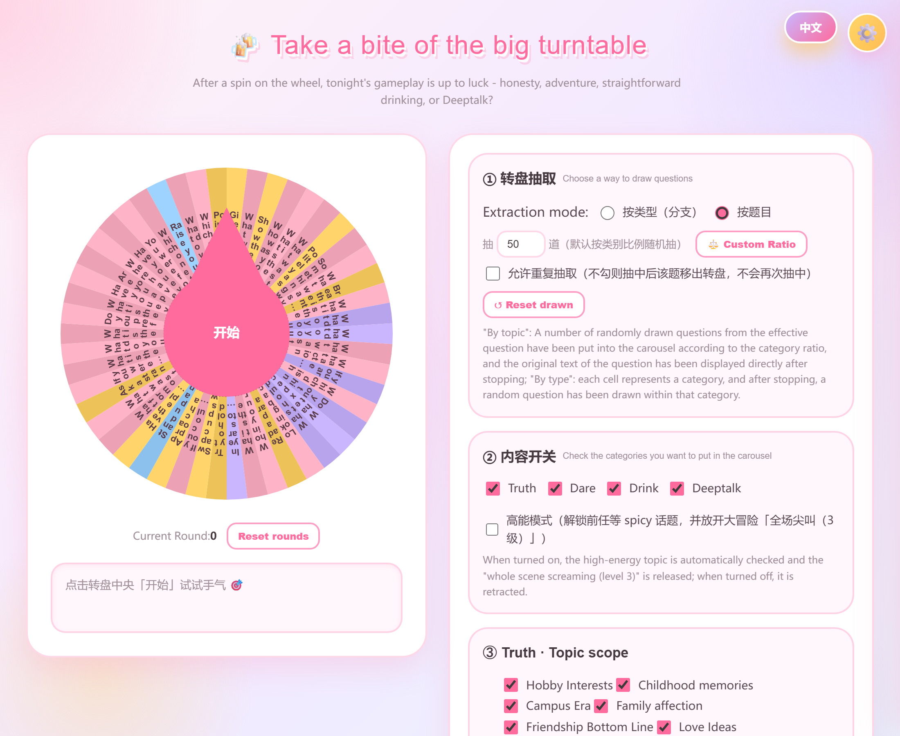
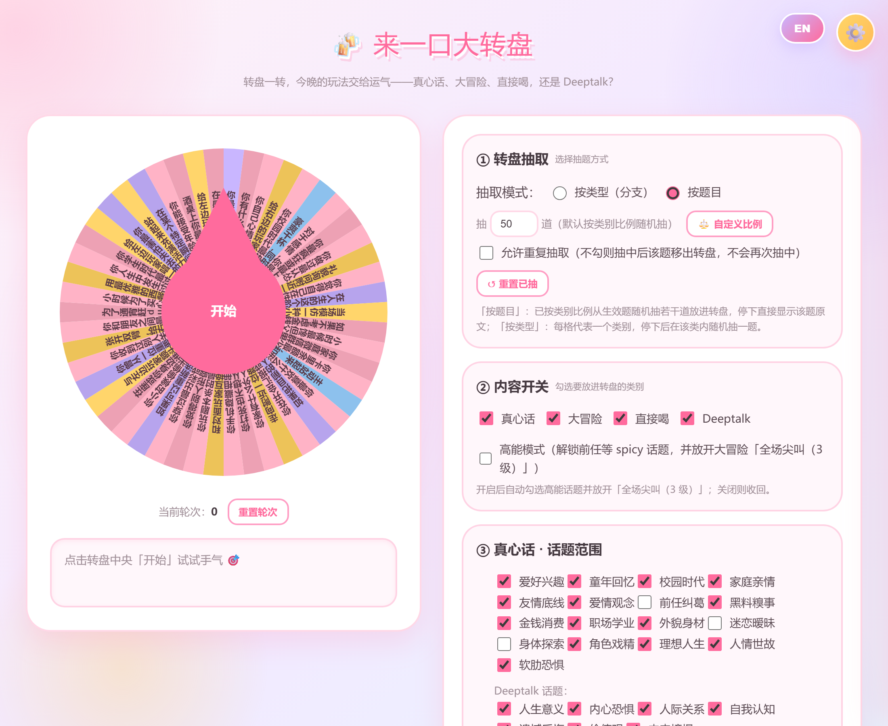
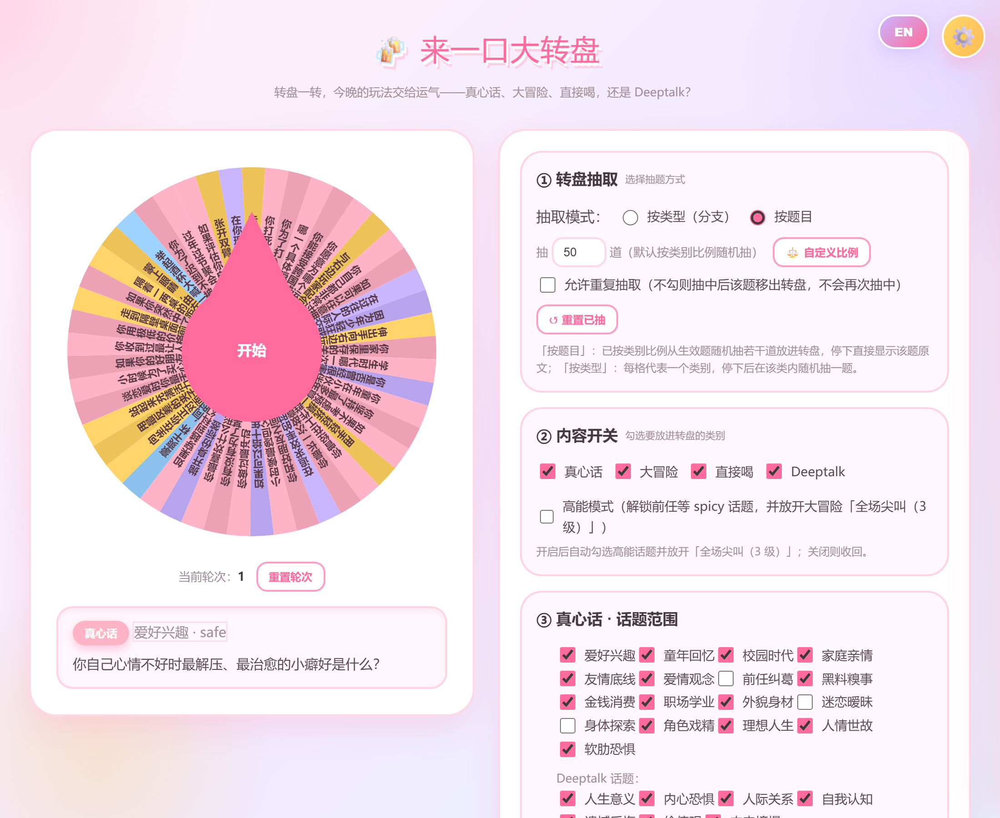
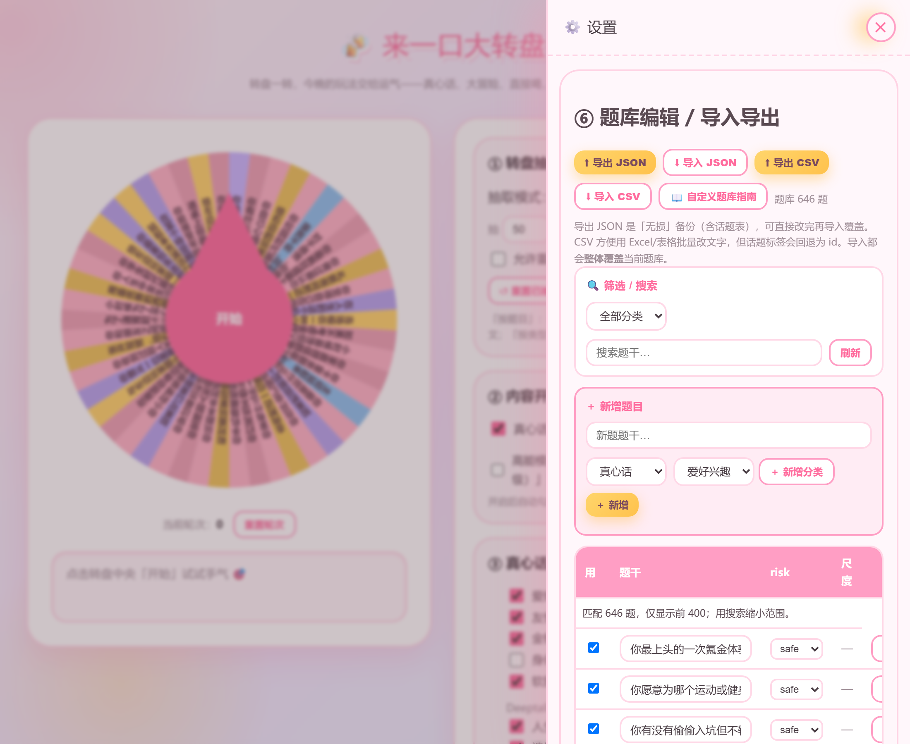
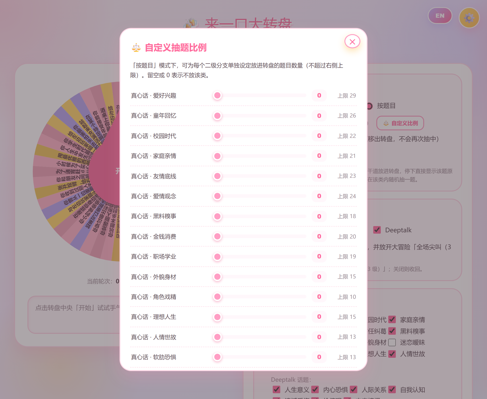

# 🍻 来一口大转盘

一个网页版随机转盘，专为聚会暖场设计。真心话 / 大冒险 / 直接喝 / Deeptalk 四大类，内置题库 646 题，双击 `app.html` 就能开始玩，无需安装、无需服务器。

> ⚠️ 使用前请确保所有参与者知情且自愿参与，并自觉把握玩笑尺度。

---

## 🌐 语言切换

点右上角 **EN / 中文** 按钮，界面、按钮、题目和内置题库会一键切换成英文/中文。



---

## 🖼 界面一览



转一下，答案直接显示在下方的结果区：



---

## ✨ 功能特性

- **四大玩法**：真心话 / 大冒险 / 直接喝 / Deeptalk，转盘配色一目了然。
- **两种转盘模式**
  - **按题目（默认）**：按类别比例从生效题中随机抽若干道放进转盘，停下直接显示原题。
  - **按类型（分支）**：每格代表一个类别，停下后在该类里随机抽一道题。
- **自定义抽题比例**：在「⚖️ 自定义比例」弹窗里细分到二级分支，用滑块设定每类放进转盘的题目数量（不超过该分支上限）。
- **精准暗箱**：可指定「第 N 次」或「前 K 次」必中某个类别，甚至必中**某一道具体题目**。
- **不重复抽取**：关闭「允许重复抽取」后，抽中的题会从转盘移除；可一键「重置已抽」。
- **⚙️ 设置抽屉**：暗箱操作、题库编辑、导入导出统一收进右侧滑出抽屉，主界面只留转盘和玩法设置。
- **题库可外部编辑**：在设置抽屉里导出 JSON（无损）或 CSV（方便用 Excel 改文字），改完再导入覆盖。
- **中英双语界面**：右上角一键切换，界面文字与内置题库同步翻译。
- **糖果童趣 UI**：明亮柔和的粉 / 黄 / 浅蓝 / 淡紫配色，圆润动效，贴合派对氛围。

---

## 🚀 快速开始

直接双击 `app.html`，用浏览器打开即可开始。

开发者如需重新构建：

```bash
node gen-bank.js   # 生成 question-bank.json
node build.js      # 把题库注入 app.src.html，生成自包含的 app.html
```

> 需要本地 Node.js。`gen-bank.js` 会重新批量生成并去重；`build.js` 把题库内联进最终 HTML。

---

## 🛠 自定义题库

- **只改题目文字**：点右上角 ⚙️ 打开设置抽屉，在「题库编辑」里导出 JSON / CSV，改完再导入覆盖。
- **重做整套题库**：改 `gen-bank.js` 的模板与词池 → `node gen-bank.js` → `node build.js`。





---

## 🗂 项目结构

| 文件 | 说明 |
| --- | --- |
| `app.html` | 主程序，双击即玩 |
| `index.html` | 轻量 starter |
| `app.src.html` | 源码模板，`build.js` 注入题库后产出 `app.html` |
| `gen-bank.js` | 题库生成器：模板 + 词池批量生成题库（含去重） |
| `build.js` | 构建脚本：把题库注入 `app.src.html` 生成 `app.html` |
| `question-bank.json` | 题库数据（646 题，含顶部 `stats` 统计） |
| `用户手册.md` | 面向玩家的详细使用手册 |

---

## 📄 许可证

仅供学习与非商业聚会娱乐使用。
